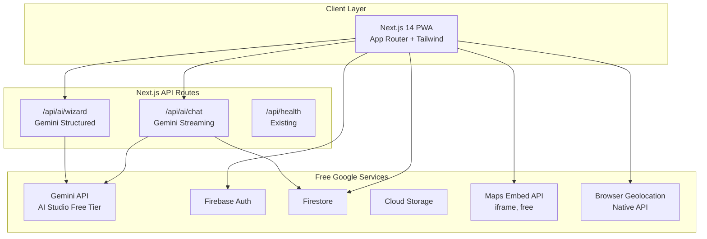
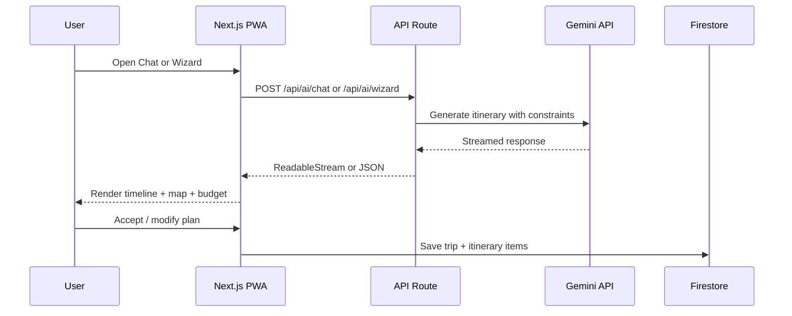
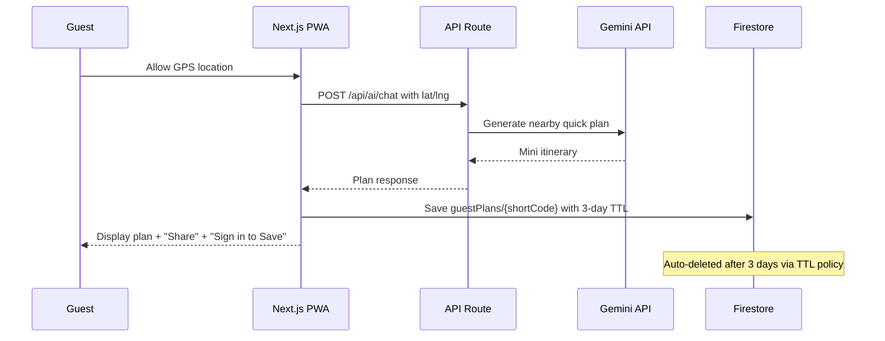
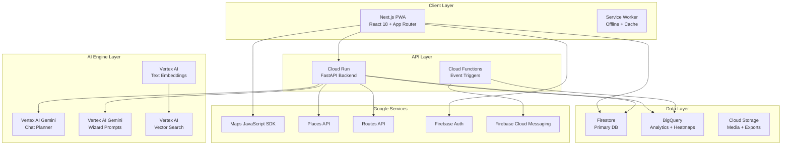

# Prayana -- Architecture

> Travel Planning & Experience -- a Google-services-only PWA built on a $5 GCP budget.

## Product Vision

Prayana is a **quality and novelty** travel planning product that operates exclusively
within the Google Cloud ecosystem. It serves two distinct user modes:

- **Pre-Plan Mode** -- Authenticated users build rich, budget-aware, AI-assisted itineraries with full persistence, trip tracking via timeline, and sharing capabilities.
- **Spontaneous Mode** -- Guest users get GPS-based quick recommendations with zero sign-up friction and 3-day expiring shareable links.

The core interaction paradigms are:
1. **Interactive Chat** -- Conversational trip planning powered by Gemini AI, where the user describes their dream trip and the AI builds it iteratively.
2. **Wizard Window** -- A structured multi-step prompt form that collects destination, dates, budget, travelers, interests, and transport preferences, then generates a complete itinerary in one shot.

Key product differentiators:
- Budget-aware planning (adjust money, days, transportation)
- Best deals and bank offers integration
- Crowd heatmap estimates across date ranges
- Categorised recommendations: must-try food, cultural experiences, thrill/adventure, shopping, souvenirs, memory-making spots, hidden gems
- Dual engine: pre-planned itineraries AND spontaneous GPS-based discovery

---

## Planning Constraints

| Constraint | Limit | Rationale |
|---|---|---|
| Repo size | < 10 MB tracked | Keep cloneable and CI-fast. Current: ~557 KB. |
| GCP monthly budget | $5 USD | Safety net only; POC targets $0 actual spend via free tiers. |
| Delivery cadence | 15-30 min sprints | Mock-first approach: ship UI, collect feedback, then wire APIs. |
| Services | Google-only | No AWS, no third-party SaaS. Firebase + GCP + Gemini exclusively. |

---

## $5 GCP Budget -- What It Actually Buys

### Detailed Service-by-Service Breakdown

| Service | Free Tier | What $5 Gets You | POC Status |
|---|---|---|---|
| Firebase Auth | 50K MAU free | Unlimited for POC | ENABLED |
| Firestore | 1 GB storage, 50K reads/day, 20K writes/day | Well within free tier | ENABLED |
| Firebase Hosting | 10 GB transfer/mo, 1 GB storage | Well within free tier | ENABLED |
| Cloud Storage | 5 GB free | Well within free tier | ENABLED |
| Firebase Analytics | Free | Free | ENABLED |
| Firebase Remote Config | Free | Free | ENABLED |
| Gemini API (AI Studio) | 15 RPM free (gemini-2.0-flash) | ~1500 requests/day at free tier | ENABLED (free) |
| Maps Embed API | Unlimited, no billing required | Free forever | ENABLED |
| Maps JavaScript SDK | $200/mo free credit (Google Maps Platform) | ~28K map loads/mo free | DEFERRED (requires billing account) |
| Places API (New) | $200/mo credit covers ~4K requests | Free credit covers POC | DEFERRED |
| Routes API | $200/mo credit covers ~2K routes | Free credit covers POC | DEFERRED |
| Geocoding API | $200/mo credit covers ~8K requests | Free credit covers POC | DEFERRED |
| Cloud Run | 2M requests/mo free, 360K vCPU-sec | Well within free tier | DEFERRED (not needed for POC) |
| Cloud Functions (2nd gen) | 2M invocations/mo free | Well within free tier | DEFERRED |
| BigQuery | 1 TB query/mo free, 10 GB storage | Free tier covers POC | DEFERRED |
| Vertex AI Vector Search | ~$0.50/hr per node minimum | Blows budget instantly | DEFERRED (paid tier) |
| Memorystore (Redis) | No free tier, ~$0.05/hr minimum | Blows budget | DEFERRED (paid tier) |
| Cloud Scheduler | 3 free jobs | Free | DEFERRED |

### POC Cost Strategy

The key insight: **Gemini API via AI Studio (not Vertex AI) is free** for low-volume use.
The $200/mo Google Maps Platform credit is separate from GCP billing and covers all
maps/places/routes needs during POC. The actual $5 GCP budget is a safety net for any
Firestore overages or accidental API calls.

**Critical distinction**: POC uses `generativelanguage.googleapis.com` (Gemini API /
AI Studio free tier), NOT `aiplatform.googleapis.com` (Vertex AI, which requires billing).
Migration to Vertex AI is a paid-tier upgrade that involves a simple SDK swap.

### Budget Alerts

- Set GCP billing alerts at $1, $3, and $5 thresholds
- Set per-API daily quota caps in GCP Console
- Gemini API: cap at 1000 requests/day via API key restrictions
- Maps Platform: cap at 100 loads/day during POC

---

## Service Tier Model

### FREE TIER (POC -- what we build now)

| Capability | Implementation | Cost |
|---|---|---|
| AI Chat Planner | Gemini API (AI Studio free tier) via Next.js API route | $0 |
| AI Wizard Prompt | Same Gemini API, structured prompt | $0 |
| Authentication | Firebase Auth (Google Sign-In) | $0 |
| Database | Firestore (free tier) | $0 |
| Hosting | Firebase Hosting | $0 |
| Map Display | Maps Embed API (iframe, free, no billing) | $0 |
| GPS Location | Browser Geolocation API (native, free) | $0 |
| Budget Tracker | Client-side calculation, Firestore storage | $0 |
| Guest Plans | Firestore TTL docs, no auth required | $0 |
| Analytics | Firebase Analytics | $0 |
| Recommendations | AI-generated via Gemini prompt (no vector search) | $0 |
| Deals/Offers | Static JSON seed data + manual curation | $0 |
| Crowd Estimates | AI-generated heuristic via Gemini (no live data) | $0 |

### PAID TIER 1: ~$25/mo (maps + places upgrade)

| Upgrade | Service |
|---|---|
| Interactive Maps | Maps JavaScript SDK (covered by $200 credit) |
| Place Details | Places API (New) with photos, reviews |
| Route Planning | Routes API with multi-modal transport |
| Geocoding | Geocoding API for address resolution |

### PAID TIER 2: ~$100/mo (intelligence layer)

| Upgrade | Service |
|---|---|
| Live Crowd Data | Places API popular times + BigQuery pipeline |
| Vector Recommendations | Vertex AI Embeddings + Vector Search |
| Push Notifications | FCM + Cloud Functions triggers |
| Deals Aggregation | Scheduled Cloud Functions + external APIs |
| Backend API | Cloud Run (FastAPI) for server-side orchestration |

### PAID TIER 3: $500+/mo (scale)

| Upgrade | Service |
|---|---|
| Session Cache | Memorystore Redis |
| Offline Maps | Maps SDK offline tiles |
| Calendar/Photos Sync | Google Calendar + Photos API integration |
| Multi-region | Cloud Run multi-region deployment |

---

## Tech Stack

| Layer | Technology |
|---|---|
| Frontend | Next.js 14 (App Router), React 18, TypeScript, Tailwind CSS |
| Auth | Firebase Auth (Google Sign-In) |
| Database | Firestore (NoSQL) |
| Storage | Cloud Storage for Firebase |
| AI | Gemini API via AI Studio free tier (`@google/generative-ai`) |
| Maps | Maps Embed API (free iframe) |
| GPS | Browser Geolocation API (native) |
| Hosting | Firebase Hosting |
| Analytics | Firebase Analytics |
| CI/CD | GitHub Actions |

---

## Architecture Diagram (POC)



**No Cloud Run, no Cloud Functions, no BigQuery, no Vertex AI** at POC stage. Everything
runs through Next.js API routes and the client-side Firebase SDK.

---

## Core Modules (POC Scope)

### Module 1: AI Travel Engine (Gemini API Free Tier)

**1a. Interactive Chat Planner**

- Next.js API route: `src/app/api/ai/chat/route.ts`
- Calls `generativelanguage.googleapis.com` (Gemini 2.0 Flash, free tier)
- Server-side API key stored in env var `GEMINI_API_KEY`, never exposed to client
- Streaming via `ReadableStream` for real-time UX
- System prompt includes: travel domain expertise, budget constraints, date ranges,
  category recommendations (food, culture, thrill, shopping, souvenirs, memory spots)
- Conversation history: last 10 messages sent as context for continuity

**1b. Wizard Window (Structured Prompt)**

- Multi-step form: destination, dates, budget, travelers, interests, transport
- Single Gemini API call with structured JSON output schema
- Returns a complete itinerary that user accepts/modifies/regenerates
- Lower token cost than multi-turn chat (single prompt/response)

**Mock-first approach**: Sprint 1 shipped with a hardcoded mock response matching the
real Gemini output schema (`src/data/mock-itinerary.ts`). Sprint 2 replaced it with
the live API while keeping the mock as a graceful fallback.

### Module 2: Budget Tracker (Client-Side)

- Pure client-side calculation engine -- no backend cost
- Firestore document: `trips/{tripId}` already has `budget` and `currency` fields
- Extended with subcollection `trips/{tripId}/expenses` for itemized tracking
- Category allocation (accommodation, food, transport, activities, shopping, contingency)
  computed locally based on AI suggestions
- Currency display only at POC (hardcoded INR/USD/EUR rates, no live conversion API)

### Module 3: Deals and Offers (Static Seed)

- **POC**: Static JSON file (`src/data/deals.json`) with curated sample deals and bank offers
- Rendered as a browseable card grid, filterable by destination and category
- Includes bank offers (HDFC, SBI) alongside travel package deals
- No live API calls, no Cloud Functions, no scheduled scraping
- **Paid tier upgrade**: Cloud Function scheduler pulling from affiliate APIs

### Module 4: Crowd Estimates (AI Heuristic)

- **POC**: Gemini prompt includes "estimate crowd levels for {destination} on {dates}"
  as part of itinerary generation
- AI returns crowd estimate (low/medium/high) per itinerary item based on training data
- Displayed as color-coded badges on the timeline component
- **Paid tier upgrade**: Places API popular times + BigQuery historical pipeline + heatmap overlay

### Module 5: Recommendations (AI-Generated)

- **POC**: All recommendations generated by Gemini as part of the chat/wizard response
- System prompt explicitly asks for categorised recommendations:
  - Must-try food and restaurants
  - Cultural experiences and festivals
  - Thrill and adventure activities
  - Shopping destinations and local markets
  - Souvenir recommendations
  - Memory-creating experiences (photo spots, sunset points, unique stays)
  - Hidden gems and off-beaten-path spots
- No vector search, no embeddings, no separate recommendation service
- **Paid tier upgrade**: Vertex AI Text Embeddings + Vector Search for personalised similarity matching

### Module 6: Map + GPS

- **POC**: Maps Embed API (free iframe, no billing account needed) showing destination on trip detail page
- Browser Geolocation API for GPS coordinates (native, zero cost)
- Spontaneous mode: GPS position passed to Gemini for "nearby recommendations" prompt
- **Paid tier upgrade**: Maps JavaScript SDK with interactive markers, route drawing, Places API enrichment

### Module 7: Dual User Model

**Authenticated User** (POC):
- Firebase Auth with Google Sign-In
- Full Firestore persistence: trips, itineraries, budget, expenses, conversations
- Trip sharing via `visibility: "shared"` (existing model)

**Guest User** (POC):
- No authentication required
- Spontaneous recommendations via Gemini + GPS
- Plan stored in Firestore `guestPlans/{shortCode}` with `expiresAt` TTL (3 days)
- Shareable link: `/g/{shortCode}`
- Upgrade prompt: "Sign in to save this trip permanently"

| Capability | Authenticated | Guest |
|---|---|---|
| Persistence | Full Firestore | 3-day TTL doc |
| AI features | Chat + Wizard | Quick spontaneous plan |
| Sharing | visibility: shared | `/g/{shortCode}` link |
| Budget tracking | Full | Not available |
| Sign-in | Firebase Auth (Google) | None required |

---

## Data Flow Diagrams

### Pre-Plan Trip Creation Flow



### Spontaneous Guest Flow



---

## Firestore Schema

```
users/{userId}                    -- UserProfile
trips/{tripId}                    -- Trip
trips/{tripId}/itinerary/{itemId} -- ItineraryItem
trips/{tripId}/expenses/{expId}   -- Expense
trips/{tripId}/conversations/{id} -- AIChatMessage
destinations/{destinationId}      -- Destination (read-only catalogue)
reviews/{reviewId}                -- Review
guestPlans/{shortCode}            -- GuestPlan (TTL: 3 days)
```

### Guest Plan Document Structure

```
guestPlans/{shortCode}
  ├── shortCode: string
  ├── plan: ItineraryItem[]
  ├── query?: string
  ├── location?: GeoPoint
  ├── createdAt: Timestamp
  ├── expiresAt: Timestamp      // createdAt + 3 days
  └── viewCount: number
```

---

## Directory Layout

```
src/
├── app/
│   ├── (auth)/
│   │   ├── login/page.tsx
│   │   └── register/page.tsx
│   ├── (dashboard)/
│   │   ├── trips/
│   │   │   ├── page.tsx                 // Trip list
│   │   │   ├── [tripId]/page.tsx        // Trip detail + timeline + map embed
│   │   │   └── new/
│   │   │       ├── chat/page.tsx        // AI chat planner
│   │   │       └── wizard/page.tsx      // Wizard prompt builder
│   │   ├── explore/page.tsx             // Destination discovery
│   │   └── deals/page.tsx               // Deals and bank offers
│   ├── (guest)/
│   │   ├── quick/page.tsx               // Spontaneous GPS entry
│   │   └── g/[shortCode]/page.tsx       // Guest plan viewer
│   ├── api/
│   │   ├── ai/
│   │   │   ├── chat/route.ts            // Gemini streaming
│   │   │   └── wizard/route.ts          // Gemini structured
│   │   └── health/route.ts              // Existing
│   ├── layout.tsx
│   ├── page.tsx
│   └── globals.css
├── components/
│   ├── ui/Button.tsx, Card.tsx, Input.tsx
│   ├── chat/ChatWindow.tsx
│   ├── wizard/WizardForm.tsx
│   ├── trip/Timeline.tsx, MapEmbed.tsx
│   ├── budget/BudgetCard.tsx
│   └── providers/AuthProvider.tsx
├── hooks/
│   ├── useAuth.ts
│   ├── useTrip.ts
│   └── useGeolocation.ts
├── lib/
│   ├── firebase.ts                      // Existing
│   ├── gemini.ts                        // Gemini API client
│   ├── api-client.ts                    // Typed fetch wrapper
│   └── guest-session.ts                 // Short code generation + TTL
├── data/
│   ├── mock-itinerary.ts               // Mock AI response for fallback
│   └── deals.json                       // Static seed deals + bank offers
├── services/
│   ├── trip-service.ts                  // Firestore CRUD
│   ├── ai-service.ts                    // Typed API client for chat/wizard
│   └── budget-service.ts               // Allocation, spend calc, currency
└── types/
    └── index.ts                         // All domain types
```

### Repo Size Budget

| Category | Estimated Size | Notes |
|---|---|---|
| Source code (src/) | ~80 KB | ~32 TS/TSX files |
| Package lock | ~413 KB | npm lockfile |
| Static data (deals.json, mock) | ~7 KB | Curated seed data |
| Config + CI/CD | ~30 KB | Already exists |
| Docs (ARCHITECTURE.md, README) | ~30 KB | This file + README |
| Public assets | ~500 KB | SVG icons, PWA manifest |
| **Total tracked** | **~560 KB** | Well under 10 MB cap |
| Headroom for growth | ~9.4 MB | Room for assets, features |

**Enforced via CI**: Add a GitHub Actions step that fails if tracked repo size exceeds
8 MB (warning at 5 MB). No images larger than 100 KB committed. SVG preferred over raster.

---

## Security Architecture (POC)

- **Gemini API key**: stored in `GEMINI_API_KEY` env var, used only in server-side API
  routes (`src/app/api/ai/*`), never exposed to client bundle.
- **Maps Embed API key**: restricted to `prayana-app.web.app` referrer in GCP Console.
- **Firestore rules**: owner-based access for trips/users, guest plans world-readable
  (create-only, no updates/deletes from client), AI conversations owner-only.
- **No secrets committed**: `.env.example` has placeholders only; `.env.local` is gitignored.
- **CSP headers**: configured in `next.config.js`, allowing Google services domains.
- **Rate limiting**: Gemini API capped at 15 RPM (free tier enforced), additional
  per-session limiting possible in API route middleware.
- **Storage rules**: image-only uploads (10 MB max), owner-scoped paths.

---

## Sprint Delivery Plan (Mock-First POC)

Each sprint ends with a deployable state and a feedback checkpoint.

### Sprint 1: Skeleton + Mock AI (15 min)

**Deliverables**:
- Directory skeleton with route groups: `(auth)`, `(dashboard)`, `(guest)`
- `useAuth` hook with Firebase Auth context and `AuthProvider`
- UI primitives: `Button`, `Card`, `Input` components
- Wizard form UI shell (`WizardForm.tsx`) with all input fields
- Mock AI response: hardcoded JSON matching `ItineraryItem[]` schema
- Wizard page renders mock itinerary as a basic timeline list
- Mock wizard API route returning seed data

**Feedback checkpoint**: "Does the wizard form capture the right inputs? Is the mock
itinerary structure what you expect?"

### Sprint 2: Live Gemini + Chat (30 min)

**Deliverables**:
- `src/lib/gemini.ts` -- Gemini API client using `@google/generative-ai` npm package
- `src/app/api/ai/wizard/route.ts` -- Gemini structured generation replacing mock
- `src/app/api/ai/chat/route.ts` -- Streaming chat endpoint with `ReadableStream`
- `ChatWindow.tsx` component with message bubbles and streaming text
- Budget constraint injected into system prompt
- Chat page (`/trips/new/chat`) functional end-to-end
- Graceful fallback to mock data when API key is absent

**Feedback checkpoint**: "Does the AI generate reasonable itineraries? Are the budget
constraints respected? Is the chat UX responsive?"

### Sprint 3: Guest Flow + Share Links (15 min)

**Deliverables**:
- `/quick` page with GPS permission flow and "Generate quick plan" button
- `guest-session.ts` with short code generation (6-char alphanumeric, crypto-random)
- Guest plan saved to Firestore `guestPlans/{shortCode}` with 3-day TTL
- `/g/{shortCode}` page renders guest plan with expiry countdown and "Sign in to save" CTA
- Copy-to-clipboard share button

**Feedback checkpoint**: "Does the guest flow feel frictionless? Is the share link
working? Is the upgrade prompt clear?"

### Sprint 4: Map + Timeline + Budget + Deals (30 min)

**Deliverables**:
- `MapEmbed.tsx` wrapping Maps Embed API iframe for trip destinations
- `Timeline.tsx` vertical day-by-day view with category icons and crowd badges
- `BudgetCard.tsx` showing planned vs actual by category with color-coded bar
- Trip detail page (`/trips/[tripId]`) composing map + timeline + budget
- `deals.json` with 8 curated deals including bank offers
- Deals page with category filter pills

**Feedback checkpoint**: "Is the trip detail page cohesive? Does the timeline read well?
Are the deals useful?"

### Sprint 5: Polish + Deploy (30 min)

**Deliverables**:
- Firebase Auth login/register pages with Google Sign-In
- Trip list page with CRUD operations
- Firestore security rules updated for new collections
- Responsive design pass (mobile-first)
- Firebase Hosting production deploy
- ARCHITECTURE.md committed to repo

**Feedback checkpoint**: "Full end-to-end walkthrough. What's missing for a demo-ready POC?"

---

## Key Architecture Decisions

| Decision | Rationale | Upgrade Path |
|---|---|---|
| **Gemini API (AI Studio) over Vertex AI** | Free tier gives 15 RPM / 1500 RPD with gemini-2.0-flash. Vertex AI requires billing from request #1. | Simple SDK swap when budget allows. |
| **Maps Embed API over Maps JS SDK** | Embed API is completely free with no billing account. Loses interactivity but shows the map. | Enable Maps Platform billing ($200/mo free credit). |
| **Next.js API routes over Cloud Run** | Eliminates an entire infrastructure layer. Gemini calls happen server-side in the same deployment. | Add Cloud Run when separating concerns at scale. |
| **Mock-first sprints** | Every feature starts with a hardcoded mock response matching the real API schema. Allows UI development and feedback collection before burning API quota. | Mocks remain as fallback when API key is absent. |
| **Static deals over live scraping** | Zero infrastructure cost. Manual curation in a JSON file. | Cloud Functions scheduler added at Paid Tier 2. |
| **AI heuristics over live data** | Crowd estimates, recommendations, and "best time to visit" all come from Gemini's training knowledge rather than live API calls. Good enough for POC. | Places API popular times + BigQuery pipeline. |
| **Repo size enforcement** | CI check prevents accidental bloat. No images larger than 100 KB committed. SVG preferred over raster. | Increase threshold as product grows. |
| **TTL-based guest cleanup** | Firestore TTL policy handles 3-day expiry with zero operational overhead. No cron job needed. | Extend TTL or convert to permanent on sign-up. |

---

## Future Roadmap (Post-POC, Paid Tiers)

When budget increases, the upgrade path is clearly separated:

1. **Enable Google Maps Platform billing** ($200/mo free credit) -- unlocks interactive
   maps, Places API, Routes API, Geocoding API.
2. **Switch Gemini API to Vertex AI** -- unlocks higher rate limits, safety controls,
   prompt tuning, and enterprise SLA.
3. **Add Cloud Functions** -- scheduled deals aggregation, push notifications via FCM,
   crowd data pipeline.
4. **Add BigQuery** -- historical analytics, crowd heatmaps by day-of-week and season,
   recommendation training data.
5. **Add Cloud Run** -- separate FastAPI backend when API route complexity outgrows
   Next.js (auth middleware, rate limiting, multi-model orchestration).
6. **Add Vertex AI Vector Search** -- personalised recommendations via text embeddings
   and similarity matching across destinations, reviews, and activities.
7. **Add Memorystore (Redis)** -- session cache and AI response cache for high-traffic
   scenarios.

### Full-Scale Architecture (Post-POC Vision)


