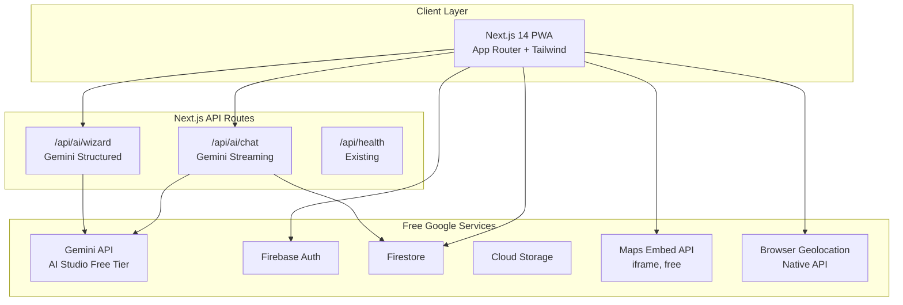

# Prayana -- Architecture

> Travel Planning & Experience -- a Google-services-only PWA built on a $5 GCP budget.

## Constraints

| Constraint | Limit |
|---|---|
| Repo size | < 10 MB tracked |
| GCP monthly budget | $5 USD (safety net; POC targets $0 actual spend) |
| Delivery cadence | 15-30 min sprints, mock-first, feedback after each |

## Tech Stack

| Layer | Technology |
|---|---|
| Frontend | Next.js 14 (App Router), React 18, TypeScript, Tailwind CSS |
| Auth | Firebase Auth (Google Sign-In) |
| Database | Firestore (NoSQL) |
| Storage | Cloud Storage for Firebase |
| AI | Gemini API via AI Studio free tier (`@google/generative-ai`) |
| Maps | Maps Embed API (free iframe) |
| GPS | Browser Geolocation API (native) |
| Hosting | Firebase Hosting |
| Analytics | Firebase Analytics |
| CI/CD | GitHub Actions |

## Architecture Diagram (POC)



No Cloud Run, Cloud Functions, BigQuery, or Vertex AI at POC stage. Everything runs
through Next.js API routes and the client-side Firebase SDK.

## Core Modules

### 1. AI Travel Engine (Gemini API Free Tier)

**Interactive Chat Planner** -- Conversational itinerary builder via `/api/ai/chat`.
Uses `gemini-2.0-flash` through `generativelanguage.googleapis.com` (AI Studio, not
Vertex AI). Streams responses via `ReadableStream`. System prompt includes travel
domain expertise, budget constraints, date ranges, and categorised recommendations
(food, culture, thrill, shopping, souvenirs, memory spots).

**Wizard Window** -- Multi-step form (destination, dates, budget, travelers, interests,
transport) that constructs a single structured prompt. Returns a complete itinerary
draft. Lower token cost than multi-turn chat.

### 2. Budget Tracker (Client-Side)

Pure client-side calculation engine stored in Firestore. Categories: accommodation,
food, transport, activities, shopping, contingency. Planned vs actual tracking.
Hardcoded INR/USD/EUR exchange rates at POC (no live conversion API).

### 3. Deals & Offers (Static Seed)

Static JSON file (`src/data/deals.json`) with curated sample deals and bank offers.
Browseable card grid with filters. No live API calls at POC.

### 4. Crowd Estimates (AI Heuristic)

Gemini prompt includes crowd level estimation per itinerary item. Returns low/medium/high
badges based on training data. No Places API popular times at POC.

### 5. Recommendations (AI-Generated)

All recommendations generated as part of chat/wizard responses. System prompt requests
categorised output: food, culture, thrill, shopping, souvenirs, memory spots, hidden
gems. No vector search or embeddings at POC.

### 6. Map + GPS

Maps Embed API (free iframe, no billing account) for destination display. Browser
Geolocation API for GPS. Spontaneous mode passes GPS coordinates to Gemini for
"nearby recommendations" prompt.

### 7. Dual User Model

| Capability | Authenticated | Guest |
|---|---|---|
| Persistence | Full Firestore | 3-day TTL doc |
| AI features | Chat + Wizard | Quick spontaneous plan |
| Sharing | visibility: shared | `/g/{shortCode}` link |
| Budget tracking | Full | Not available |
| Sign-in | Firebase Auth (Google) | None required |

Guest plans stored in `guestPlans/{shortCode}` with `expiresAt` TTL. Firestore TTL
policy handles automatic cleanup.

## Firestore Schema

```
users/{userId}                    -- UserProfile
trips/{tripId}                    -- Trip
trips/{tripId}/itinerary/{itemId} -- ItineraryItem
trips/{tripId}/expenses/{expId}   -- Expense
trips/{tripId}/conversations/{id} -- AIChatMessage
destinations/{destinationId}      -- Destination (read-only catalogue)
reviews/{reviewId}                -- Review
guestPlans/{shortCode}            -- GuestPlan (TTL: 3 days)
```

## $5 GCP Budget Model

### Free Tier Services (POC)

| Service | Free Allowance | POC Usage |
|---|---|---|
| Firebase Auth | 50K MAU | Well within |
| Firestore | 1 GB, 50K reads/day | Well within |
| Firebase Hosting | 10 GB transfer/mo | Well within |
| Cloud Storage | 5 GB | Well within |
| Gemini API (AI Studio) | 15 RPM, 1500 RPD | ENABLED |
| Maps Embed API | Unlimited | ENABLED |
| Firebase Analytics | Free | ENABLED |

### Deferred Services (Paid Tiers)

| Tier | Monthly Cost | Services Unlocked |
|---|---|---|
| Tier 1 | ~$25 | Maps JS SDK, Places API, Routes API, Geocoding (covered by $200/mo Maps credit) |
| Tier 2 | ~$100 | Vertex AI, Cloud Functions, BigQuery, FCM, Cloud Run |
| Tier 3 | $500+ | Memorystore Redis, offline maps, Google Calendar/Photos sync |

### Budget Alerts

- GCP billing alerts at $1, $3, $5
- Per-API daily quota caps in GCP Console
- Gemini: 1000 req/day cap via API key restrictions
- Maps Platform: 100 loads/day during POC

## Directory Layout

```
src/
├── app/
│   ├── (auth)/login, register
│   ├── (dashboard)/trips, explore
│   ├── (guest)/quick, g/[shortCode]
│   └── api/ai/chat, ai/wizard, health
├── components/ui, chat, wizard, trip, budget
├── hooks/useAuth, useTrip, useGeolocation
├── lib/firebase, gemini, api-client, guest-session
├── data/deals.json
├── services/trip-service, ai-service, budget-service
└── types/index.ts
```

## Security

- Gemini API key: server-side only (`GEMINI_API_KEY` env var), never in client bundle
- Maps Embed key: referrer-restricted in GCP Console
- Firestore rules: owner-based access, guest plans world-readable, AI conversations owner-only
- No secrets committed; `.env.example` has placeholders only
- CSP headers configured in `next.config.js`

## Sprint Delivery Plan

| Sprint | Time | Deliverables |
|---|---|---|
| 1 | 15 min | Directory skeleton, auth context, wizard form with mock AI |
| 2 | 30 min | Live Gemini streaming, chat UI, budget constraints in prompt |
| 3 | 15 min | Guest flow, shortCode links, TTL Firestore docs |
| 4 | 30 min | Maps Embed, timeline component, budget cards |
| 5 | 30 min | Auth pages, trip CRUD, Firestore rules, deploy |

## Key Decisions

- **Gemini API (AI Studio) over Vertex AI** -- free tier, no billing required. Simple SDK swap to Vertex when budget allows.
- **Maps Embed API over Maps JS SDK** -- completely free, no billing account. Loses interactivity. Upgrade path clear.
- **Next.js API routes over Cloud Run** -- eliminates infrastructure layer. Server-side Gemini calls in same deployment.
- **Mock-first sprints** -- UI feedback before burning API quota.
- **Static deals over live scraping** -- zero infra cost. Manual JSON curation.
- **AI heuristics over live data** -- crowd estimates and recommendations from Gemini training data, not live APIs.
- **Repo size enforcement** -- CI check at 8 MB warning, fail at 10 MB.

## Repo Size Budget

| Category | Estimated Size |
|---|---|
| Source code (src/) | ~200 KB |
| Static data (deals.json) | ~50 KB |
| Config + CI/CD | ~30 KB |
| Docs | ~50 KB |
| Public assets | ~500 KB |
| **Total** | **~830 KB** |
| Headroom | ~9.2 MB |
